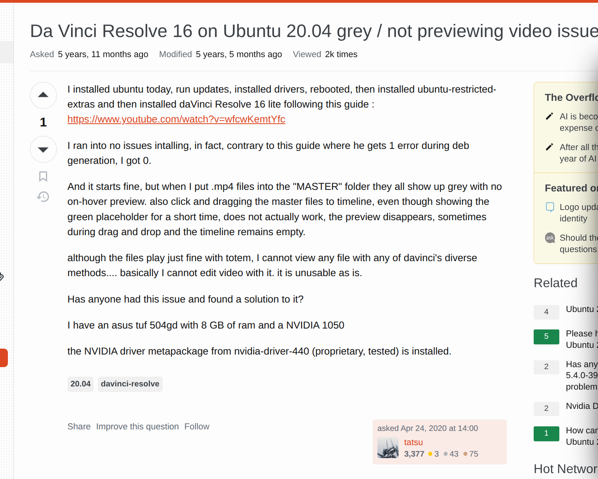
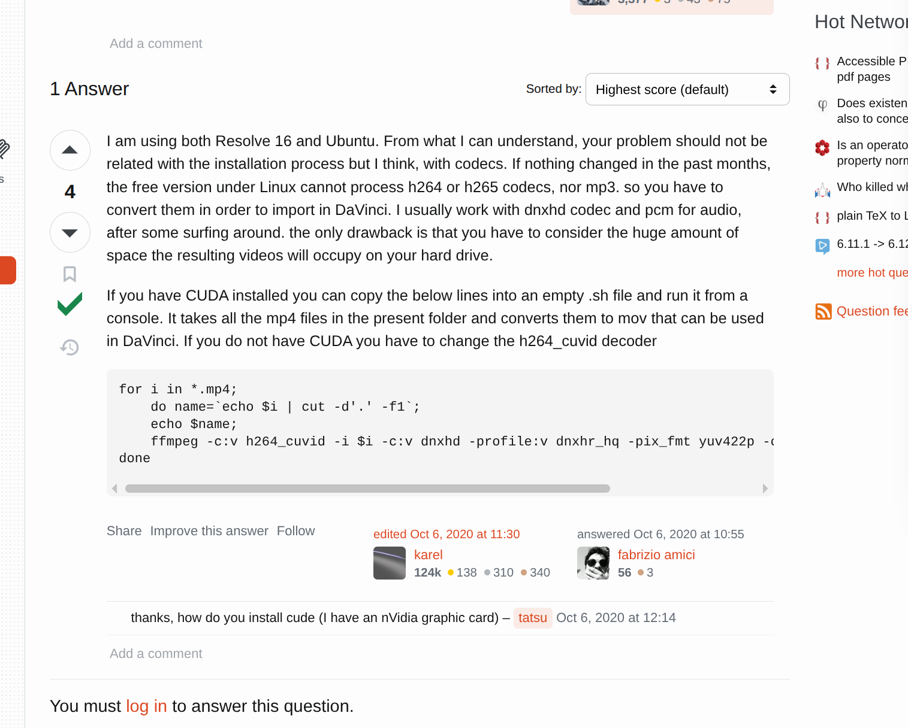

# davinci_resolve_wtf
A simple video converter for davinci resolve free

[Issue Link](https://askubuntu.com/questions/1230324/da-vinci-resolve-16-on-ubuntu-20-04-grey-not-previewing-video-issue)

In case this link does not works





And this is what my reaction


So basically i have to use ffmpeg to convert it to the codec that free version of davinci solove support.

So here is the program project idea. to make my life easier.

**You can input a folder path, and it will copy the folder structure for the result folder, and it find all the video files then converts and put it in the result folder**

Basically this

* root
  * source
    * subfolder
      * video_special.mp4
    * video0.mp4
    * video1.mp4

And you use the program then it generate this

* root
  * source
    * subfolder
      * video_special.mp4
    * video0.mp4
    * video1.mp4
  * result
    * subfolder
      * video_special.mov
    * video0.mov
    * video1.mov

Then i can just import from result folder, everyone is happy i guess


## Install

```bash
npm i -g davinci_resolve_wtf
```

## Use

```bash
# For print out all the possible command
ds_wtf -h
```

## Command Details

#### -i --input

Default: Current command execute location\
Description: The input source folder

#### -o --output

Default: Current command execute location + '../result/'\
Description: The output source folder

#### -e --ext

Default: ".mp4/.mov/.mkv/.wmv/.flv"\
Description: Filter extensions

#### -f --force

Default: 0
Description: Overwrite exist files, 0: Skip, 1: YES